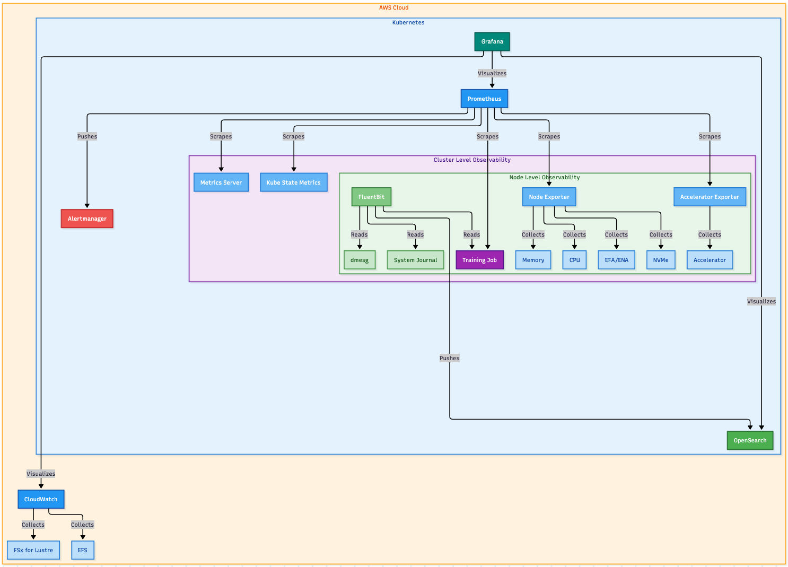
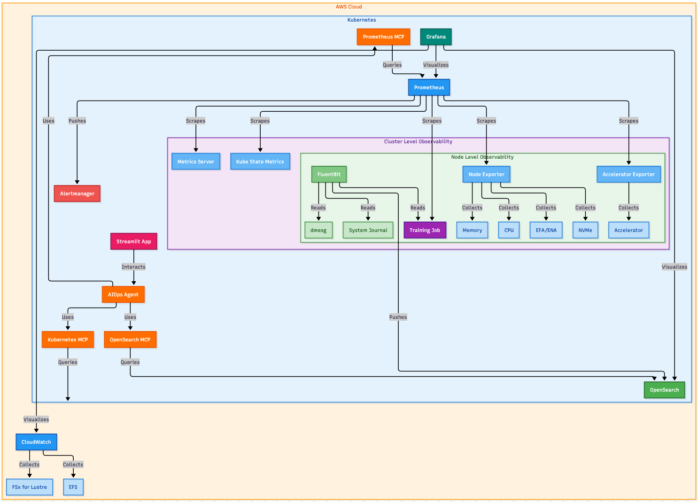

# ai-ml-observability-reference-architecture
This project provides a comprehensive monitoring solution for AI and ML workloads running on Kubernetes.

## About
This open source observability stack integrates three key components to deliver end-to-end visibility into AI/ML infrastructure and applications:
* **Prometheus** serves as the core metrics collection and storage engine, gathering performance data from GPU utilization and memory metrics (via DCGM for NVIDIA GPUs), CPU, memory, network, and storage metrics from Kubernetes nodes, application-specific metrics from AI/ML workloads like Ray training jobs and vLLM inference servers, and Kubernetes cluster metrics and resource utilization.
* **Grafana** functions as the primary visualization and dashboarding platform, providing pre-built dashboards for GPU training workloads that correlate logs with GPU, CPU, RAM, network, and storage metrics, inference monitoring dashboards that track vLLM server performance alongside GPU utilization, real-time visualization of AI/ML job performance with 5-second refresh intervals, and integration with both Prometheus (metrics) and OpenSearch (logs) data sources.
* **Fluent Bit** handles comprehensive log aggregation and forwarding by collecting container logs from AI/ML workloads using tail inputs, gathering system logs via systemd integration, processing kernel-level logs for infrastructure,  monitoring, applying Kubernetes metadata enrichment to correlate logs with specific pods and services, forwarding all processed logs to OpenSearch for centralized storage and analysis.


## Why?


Typically, the initial interest in AI/ML observability regards GPU utilization: is it 100%? When it's not, we start to wonder why.
Investigating why may lead Data Scientists or Machine Learning Engineers into their code rather than infrastructure,
or SREs to infrastructure when the problem may be code. Additionally, if things fail, it can be very challenging to understand
why without a view of the entire picture.

Creating a reference architecture for AI/ML observability enables all parties to be able to quickly understand how effectively
hardware is being utilized, while also allowing for faster root cause analysis of issues.

### Traditional observability



In a traditional setup, SREs and platform engineers are the glue between dashboards and action. An alert fires, an engineer opens Grafana, writes PromQL queries, cross-references logs in OpenSearch, checks pod status with kubectl, and pieces together a diagnosis. This works, but it requires deep familiarity with the tooling, the query languages, and the system topology. For AI/ML workloads — where GPU metrics, training hyperparameters, and infrastructure telemetry all interact — the cognitive load is even higher.

### Agent-augmented observability



This repository also supports an agent-augmented approach. By deploying MCP (Model Context Protocol) servers alongside the observability stack, an AI agent can directly query Prometheus metrics, search OpenSearch logs, and inspect Kubernetes resources — the same data sources an SRE would use, but accessed programmatically through tool use. The agent can correlate GPU utilization with node-level bottlenecks, cross-reference cost data from OpenCost, inspect training code stored in ConfigMaps, and surface actionable recommendations — all from a single natural language prompt.

This doesn't replace SREs. It gives them a faster path from alert to diagnosis, handles the routine correlation work that eats up incident response time, and makes the observability stack accessible to ML engineers who may not know PromQL or the OpenSearch query syntax. See the [agent documentation](deploy/agent/README.md) for setup and usage.

### Deployment

This repository provides two deployment methods — Kustomize and Helm — to deploy the observability stack.
The components can be configured or swapped, but the philosophy remains the same: aggregate the important data to quickly
enable diagnoses. Bring your own cluster, deploy the stack, and test out the examples or skip ahead to monitoring your own jobs.


## Getting started

### Prerequisites
A Kubernetes cluster
- Optional components:
  - nvidia device drivers/dcgm (if using)
  - neuron device drivers/neuron-monitor (if using)
  - kuberay (if using)
- Client tools:
  - `kubectl` (tested with v1.30.0)
  - `kustomize` (tested with v5.0.4-0.20230601165947-6ce0bf390ce3) — required for Kustomize deployment
  - `helm` (tested with v3.15.0) — required for both deployment methods

### Deployment

This repository supports two deployment methods. Both deploy the same observability stack. Choose the one that fits your workflow.

#### Option 1: Kustomize

The `deploy/` directory contains a Kustomize-based deployment. This is the original deployment method and deploys all core components (Prometheus, Grafana, OpenSearch, Fluent Bit, OpenCost, dashboards, and endpoints).

```bash
git clone https://github.com/awslabs/ai-ml-observability-reference-architecture.git
cd ai-ml-observability-reference-architecture
kustomize build --enable-helm deploy/ | kubectl create -f -
```

To include MCP servers with the Kustomize deployment, uncomment `- mcp` in `deploy/kustomization.yaml`:

```yaml
resources:
  - monitoring-namespace.yaml
  - prometheus-stack
  - opensearch
  - fluentbit
  - opencost
  - endpoints
  - dashboards
  - mcp              # uncomment this line
```

Then re-run the `kustomize build` command.

#### Option 2: Helm

The `chart/` directory contains a Helm umbrella chart that deploys the same stack with the added ability to toggle individual components on or off via `values.yaml`.

```bash
git clone https://github.com/awslabs/ai-ml-observability-reference-architecture.git
cd ai-ml-observability-reference-architecture

# Download subchart dependencies
helm dependency build chart/

# Install with default settings (all core components enabled, MCP disabled)
helm install observability chart/ -n monitoring --create-namespace
```

To enable MCP servers:
```bash
helm install observability chart/ -n monitoring --create-namespace --set mcp.enabled=true
```

To upgrade an existing release (e.g. to enable MCP after initial install):
```bash
helm upgrade observability chart/ -n monitoring --set mcp.enabled=true
```

To disable a specific component:
```bash
helm install observability chart/ -n monitoring --create-namespace --set opencost.enabled=false
```

Or provide a custom values file:
```bash
helm install observability chart/ -n monitoring --create-namespace -f my-values.yaml
```

### Components

The following components are deployed by both methods. The Helm `values.yaml` key for each is shown in parentheses.

| Component | Description | Helm toggle | Default |
|-----------|-------------|-------------|---------|
| Prometheus + Grafana | Metrics collection, storage, and visualization | `prometheus-stack.enabled` | `true` |
| OpenSearch | Log storage and search (operator + cluster) | `opensearch.enabled` | `true` |
| Fluent Bit | Log collection and forwarding | `fluentbit.enabled` | `true` |
| OpenCost | Kubernetes cost monitoring | `opencost.enabled` | `true` |
| Endpoints | Ray ServiceMonitor, PodMonitor, and PrometheusRule | `endpoints.enabled` | `true` |
| Dashboards | Grafana dashboards for GPU training and inference | `dashboards.enabled` | `true` |
| MCP Servers | Model Context Protocol servers for Kubernetes, OpenSearch, and Prometheus | `mcp.enabled` | `false` |

### MCP Servers

> **WARNING: The MCP servers ship with intentionally permissive defaults for ease of evaluation. Before deploying to shared clusters, you must scope their permissions appropriately.**
>
> - **Kubernetes MCP** is the most critical. It binds to the `edit` ClusterRole, which grants read/write access to most resources across **all namespaces**. In live deployments, replace the ClusterRoleBinding with a namespaced RoleBinding and a least-privilege Role that only permits the operations your agents actually need.
> - **OpenSearch MCP** authenticates with the OpenSearch admin credentials, giving it full index access. Consider creating a dedicated read-only OpenSearch user.
> - **Prometheus MCP** has read-only query access to Prometheus, which is the least sensitive, but still exposes all metric data in the cluster.

The MCP (Model Context Protocol) servers provide tool-use interfaces to the observability stack, enabling AI agents to query Prometheus metrics, search OpenSearch logs, and inspect Kubernetes resources.

Three MCP servers are included:

| Server | Image | Port | Default permissions |
|--------|-------|------|---------------------|
| Kubernetes MCP | `quay.io/containers/kubernetes_mcp_server:v0.0.57` | 8080 | `edit` ClusterRole (read/write, all namespaces) |
| OpenSearch MCP | `opensearch-mcp-server-py==0.7.0` | 9900 | OpenSearch admin credentials (full index access) |
| Prometheus MCP | `ghcr.io/pab1it0/prometheus-mcp-server:1.5.3` | 8080 | Read-only PromQL query access |

With the Helm chart, each server can be individually toggled:

```bash
# Enable MCP but only deploy the Prometheus server
helm install observability chart/ -n monitoring --create-namespace \
  --set mcp.enabled=true \
  --set mcp.kubernetes.enabled=false \
  --set mcp.opensearch.enabled=false
```

### Helm Values Reference

The full set of configurable values is in [`chart/values.yaml`](chart/values.yaml). Key sections:

```yaml
# Component toggles
prometheus-stack:
  enabled: true
opensearch:
  enabled: true
  credentials:
    adminUsername: admin
    adminPassword: admin123
    dashboardUserPassword: admin123
fluentbit:
  enabled: true
opencost:
  enabled: true
endpoints:
  enabled: true
dashboards:
  enabled: true
mcp:
  enabled: false
  kubernetes:
    enabled: true
  opensearch:
    enabled: true
  prometheus:
    enabled: true

# Subchart configuration (passed through to upstream Helm charts)
kube-prometheus-stack:
  grafana:
    plugins:
      - grafana-opensearch-datasource

fluent-operator:
  # ...

opencost:
  # ...
```

Subchart values are passed through directly to the upstream Helm charts. For full configuration options, refer to each chart's documentation:
- [kube-prometheus-stack](https://github.com/prometheus-community/helm-charts/tree/main/charts/kube-prometheus-stack)
- [opensearch-operator](https://github.com/opensearch-project/opensearch-k8s-operator/tree/main/charts/opensearch-operator)
- [fluent-operator](https://github.com/fluent/fluent-operator/tree/master/charts/fluent-operator)
- [opencost](https://github.com/opencost/opencost-helm-chart/tree/main/charts/opencost)

### Security
Both deployment methods use default credentials for Grafana and OpenSearch. To change them:

#### Grafana
- **Kustomize**: Uncomment and set `adminUser` and `adminPassword` in `deploy/prometheus-stack/kustomization.yaml`
- **Helm**: Set via values:
  ```bash
  helm install observability chart/ -n monitoring --create-namespace \
    --set kube-prometheus-stack.grafana.adminUser=myadmin \
    --set kube-prometheus-stack.grafana.adminPassword=mypassword
  ```

#### OpenSearch
- **Kustomize**:
  - Update `deploy/opensearch/admin-credentials-secret.yaml` with base64 encoded username and password
  - Update `deploy/opensearch/securityconfig-secret.yaml` admin hash. Generate the bcrypt hash with:
    ```bash
    python3 -c 'import bcrypt; print(bcrypt.hashpw("YOUR_PASSWORD".encode("utf-8"), bcrypt.gensalt(12, prefix=b"2a")).decode("utf-8"))'
    ```
  - Update `deploy/prometheus-stack/data-sources/opensearch.yaml` and update the `basicAuthUser` and `basicAuthPassword`
- **Helm**: Set the credentials via values. The password is automatically base64-encoded for the Kubernetes Secret, passed in plaintext to the Grafana datasource, and bcrypt-hashed for the OpenSearch security config — no manual hash generation needed:
  ```bash
  helm install observability chart/ -n monitoring --create-namespace \
    --set opensearch.credentials.adminUsername=myadmin \
    --set opensearch.credentials.adminPassword=YOUR_PASSWORD \
    --set opensearch.credentials.dashboardUserPassword=YOUR_PASSWORD
  ```

### Example

#### Setup
To quickstart, we will leverage the AI on EKS JARK infrastructure. This infrastructure will give us a Kubernetes environment with GPU and Neuron autoscaling to run the example job, KubeRay operator to run Ray jobs, and the observability architecture already deployed.

Follow the AI on EKS [JARK deployment](https://awslabs.github.io/ai-on-eks/docs/infra/ai-ml/jark)

Wait for the environment to be fully running.

#### Training


A reference dashboard is provided to illustrate correlating logs with metrics from the GPU, CPU, RAM, network, and storage. To deploy the example job:

`kustomize build examples/training | kubectl create -f -`

This will deploy a 4 GPU training job to finetune a llama 3.2-1B model for instruction finetuning.

After the job starts:

`kubectl port-forward -n monitoring svc/kube-prometheus-stack-grafana 3000:80`.

You can then open the following link to see the dashboard for the training job: http://localhost:3000/d/ee6mbjghme96oc/gpu-training?orgId=1&refresh=5s&var-namespace=default&var-job=ray-train&var-instance=All

#### Inference


A reference dashboard is provided to illustrate correlating logs with for vLLM with GPU and vLLM metrics. To deploy the example inference server:
1) Create a Hugging Face account: https://huggingface.co/join
2) Create a Hugging Face token: https://huggingface.co/docs/hub/en/security-tokens. Make sure you copy the token, it will not be displayed again.
3) Create a Kuberetes secret from the token: `kubectl create secret generic hf-token --from-literal=token=TOKEN` (replace `TOKEN` with the token you copied from the previous step)
4) `kustomize build examples/inference | kubectl create -f -`

This will deploy a GPU inference server for llama 3.2-1B model.

After the server starts:

`kubectl port-forward -n monitoring svc/kube-prometheus-stack-grafana 3000:80`.

You can then open the following link to see the dashboard for the inference server: http://localhost:3000/d/bec31e71-3ac5-4133-b2e3-b9f75c8ab56c/inference-dashboard?orgId=1&refresh=5s

Finally, you can send requests to the inference server. Port forward the inference port:

`kubectl port-forward svc/ray-serve 8000`
Then you can send continuous requests:
```bash
while true; do curl --location 'http://localhost:8000/vllm' \
--header 'Content-Type: application/json' \
--data '{"prompt": "this is a test"}'; done;
```

You should start to see data coming in to the dashboard shortly. To stop sending requests press `ctrl + c` in the terminal.

## Repository Structure

```
deploy/                     # Kustomize-based deployment (original)
  kustomization.yaml        # Root kustomization referencing all components
  monitoring-namespace.yaml
  prometheus-stack/          # kube-prometheus-stack Helm chart + Grafana datasources
  opensearch/                # opensearch-operator Helm chart + cluster config
  fluentbit/                 # fluent-operator Helm chart + pipeline config
  opencost/                  # opencost Helm chart
  endpoints/                 # Ray ServiceMonitor, PodMonitor, PrometheusRule
  dashboards/                # Grafana dashboard ConfigMaps
  mcp/                       # MCP server deployments (not included by default)
  agent/                     # AI optimization agent and Streamlit UI

chart/                       # Helm umbrella chart
  Chart.yaml                 # Declares the same 4 upstream charts as dependencies
  values.yaml                # Component toggles and subchart configuration
  templates/                 # Templated versions of all custom resources
  files/dashboards/          # Raw Grafana dashboard JSON files

examples/
  training/                  # Example Ray training job
  inference/                 # Example vLLM inference server
```

## Support
Please open an issue

## Roadmap

## Contributing
Contributions are always welcome!
