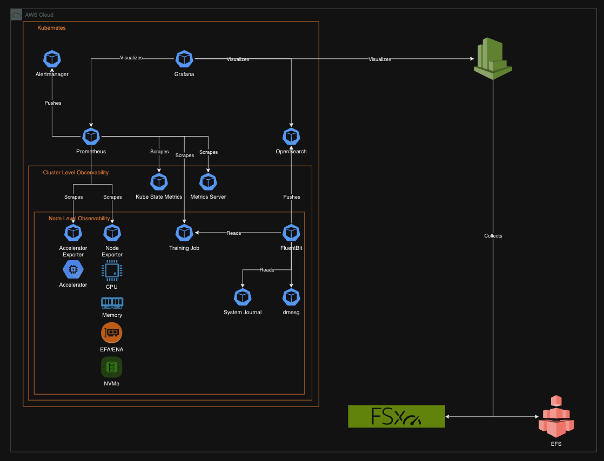
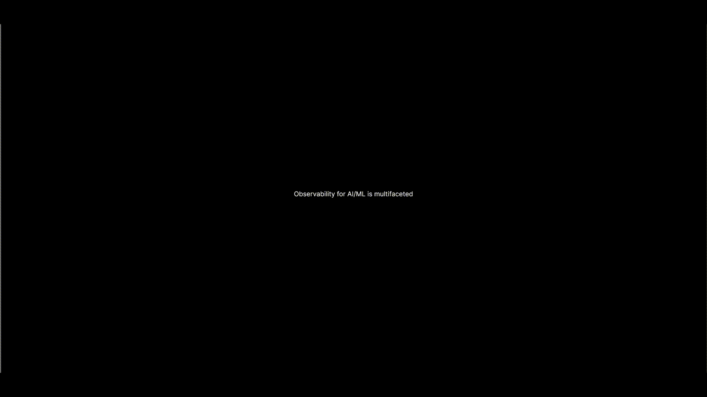
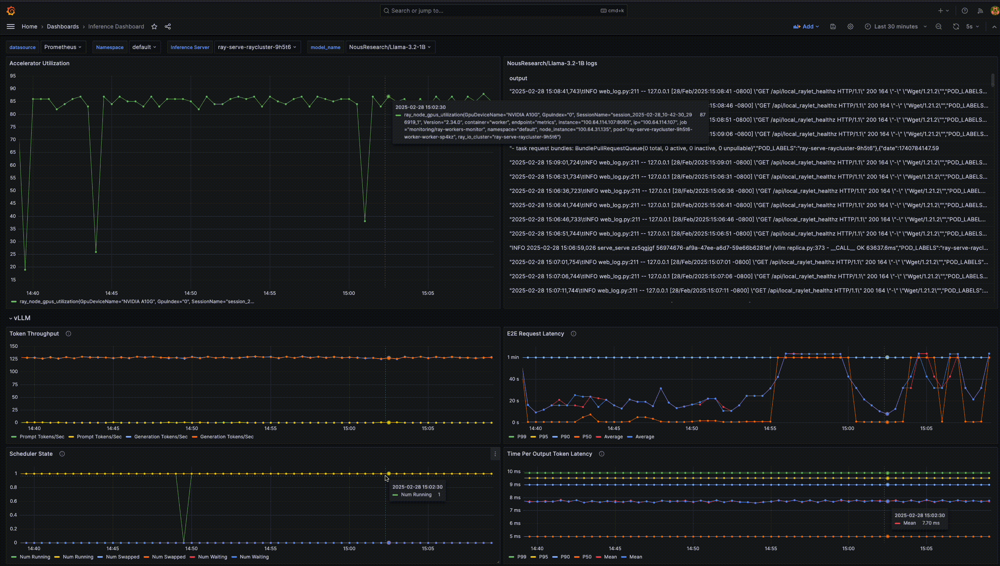

# ai-ml-observability-reference-architecture

## What is it?
A reference architecture for AI and ML Observability.



## Why?


Typically, the initial interest in AI/ML observability regards GPU utilization: is it 100%? When it's not, we start to wonder why. 
Investigating why may lead Data Scientists or Machine Learning Engineers into their code rather than infrastructure, 
or SREs to infrastructure when the problem may be code. Additionally, if things fail, it can be very challenging to understand 
why without a view of the entire picture

Creating a reference architecture for AI/ML observability enables all parties to be able to quickly understand how effectively
hardware is being utilized, while also allowing for faster root cause analysis of issues.

This repository contains a helm chart which will deploy an open source observability stack. The components can be configured or swapped, 
but the philosophy remains the same: aggregate the important data to quickly enable diagnoses. Bring your own cluster, deploy the charts, 
and test out the examples or skip ahead to monitoring your own jobs.  


## Getting started

### Prerequisites
A Kubernetes cluster
- Optional components:
  - nvidia device drivers/dcgm (if using)
  - neuron device drivers/neuron-monitor (if using)
  - kuberay (if using)
- Client tools:
  - `kubectl` (tested with v1.30.0)
  - `kustomize` (tested with v5.0.4-0.20230601165947-6ce0bf390ce3)
  - `helm` (tested with v3.15.0)

### Installation
`kustomize build --enable-helm deploy/ | kubectl create -f -`

### Security
The installation above uses the default username and password for Grafana and OpenSearch. To change the usernames and passwords, follow:

#### Grafana
Uncomment and set `adminUser` and `adminPassword` in `deploy/prometheus-stack/kustomization.yaml`

#### OpenSearch
- Update `deploy/opensearch/admin-credentials-secret.yaml` with base64 encoded username and password
- Update `deploy/opensearch/securityconfig-secret.yaml` admin hash with the password hashed using `python -c 'import bcrypt; print(bcrypt.hashpw("admin123".encode("utf-8"), bcrypt.gensalt(12, prefix=b"2a")).decode("utf-8"))'`. Replace `admin123` with your password
- Update `deploy/prometheus-stack/data-sources/opensearch.yaml` and update the `basicAuthUser` and `basicAuthPassword`

### Example

#### Setup
To quickstart, we will leverage the AI on EKS base infrastructure blueprint. This blueprint will give us a Kubernetes environment with GPU and Neuron autoscaling to run the example job.

Follow the AI on EKS [JARK deployment](https://awslabs.github.io/ai-on-eks/docs/infra/ai-ml/jark)

Wait for the environment to be fully running. 

#### Training


A reference dashboard is provided to illustrate correlating logs with metrics from the GPU, CPU, RAM, network, and storage. To deploy the example job:

`kustomize build examples/training | kubectl create -f -`

This will deploy a 4 GPU training job to finetune a llama 3.2-1B model for instruction finetuning.

After the job starts: 

`kubectl port-forward -n monitoring svc/kube-prometheus-stack-grafana 3000:80`. 

You can then open the following link to see the dashboard for the training job: http://localhost:3000/d/ee6mbjghme96oc/gpu-training?orgId=1&refresh=5s&var-namespace=default&var-job=ray-train&var-instance=All

#### Inference


A reference dashboard is provided to illustrate correlating logs with for vLLM with GPU and vLLM metrics. To deploy the example inference server:
1) Create a Hugging Face account: https://huggingface.co/join
2) Create a Hugging Face token: https://huggingface.co/docs/hub/en/security-tokens. Make sure you copy the token, it will not be displayed again.
3) Create a Kuberetes secret from the token: `kubectl create secret generic hf-token --from-literal=token=TOKEN` (replace `TOKEN` with the token you copied from the previous step)
4) `kustomize build examples/inference | kubectl create -f -`

This will deploy a GPU inference server for llama 3.2-1B model.

After the server starts:

`kubectl port-forward -n monitoring svc/kube-prometheus-stack-grafana 3000:80`.

You can then open the following link to see the dashboard for the inference server: http://localhost:3000/d/bec31e71-3ac5-4133-b2e3-b9f75c8ab56c/inference-dashboard?orgId=1&refresh=5s

Finally, you can send requests to the inference server. Port forward the inference port: 

`kubectl port-forward svc/ray-serve 8000`
Then you can send continuous requests: 
```bash
while true; do curl --location 'http://localhost:8000/vllm' \                                                                ✘ INT  base  15:20:46
--header 'Content-Type: application/json' \
--data '{"prompt": "this is a test"}'; done;
```

You should start to see data coming in to the dashboard shortly. To stop sending requests press `ctrl + c` in the terminal.

## Support
Please open an issue

## Roadmap

## Contributing
Contributions are always welcome!
